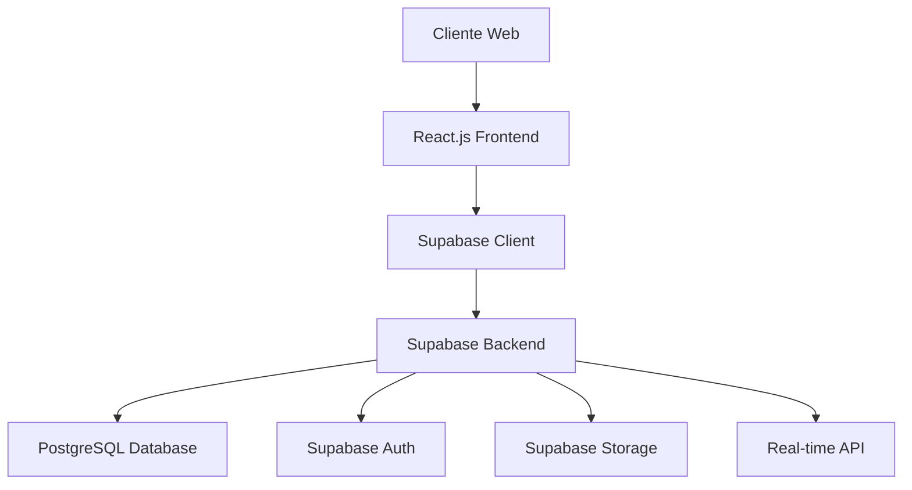
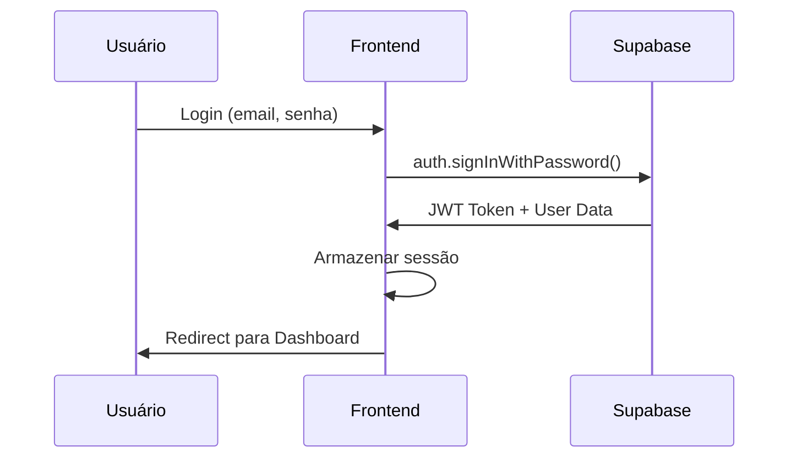
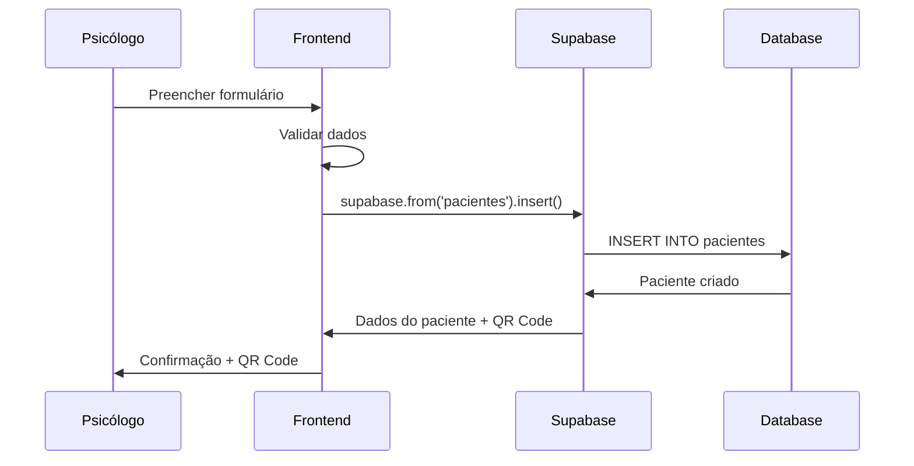
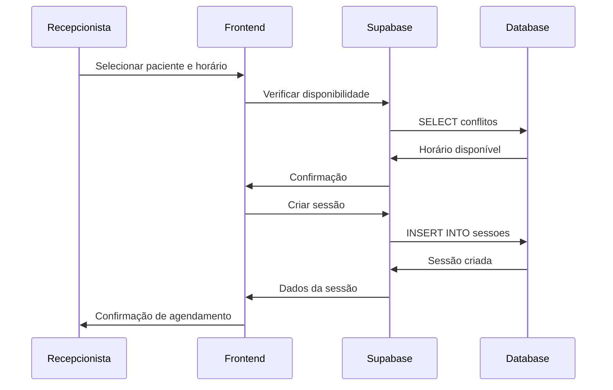

# Arquitetura do RegiFlex

**Versão:** 2.0 - Supabase  
**Data:** Outubro 2025  
**Status:** ✅ Produção

---

## 🏗️ Visão Geral da Arquitetura

O RegiFlex utiliza uma **arquitetura moderna e simplificada** baseada em **Supabase** como Backend-as-a-Service (BaaS) e **React.js** como frontend. Esta arquitetura elimina a necessidade de gerenciar servidores próprios, oferecendo escalabilidade automática e redução de custos operacionais.



---

## 🎯 Pilares Arquiteturais

### 1. **Simplicidade**
- Uma única stack tecnológica
- Configuração mínima necessária
- Deploy simplificado

### 2. **Escalabilidade**
- Auto-scaling do Supabase
- CDN global automático
- Performance otimizada

### 3. **Segurança**
- Row Level Security (RLS) nativo
- Autenticação gerenciada
- HTTPS por padrão

### 4. **Produtividade**
- API RESTful gerada automaticamente
- Real-time subscriptions
- Backup automático

---

## 🔧 Componentes da Arquitetura

### Frontend (React.js)

**Localização:** `/frontend/`

**Tecnologias:**
- **React 18.3.1** - Biblioteca principal
- **Vite 5.2.0** - Build tool e dev server
- **Tailwind CSS 3.4.4** - Framework CSS
- **Shadcn/ui** - Componentes UI
- **React Router 7.6.1** - Roteamento
- **Supabase Client 2.74.0** - Integração com backend

**Estrutura:**
```
frontend/
├── src/
│   ├── components/          # Componentes React
│   ├── contexts/            # Context API (Auth, etc.)
│   ├── lib/                 # Utilitários e configurações
│   ├── services/            # Serviços de API
│   └── assets/              # Imagens e recursos estáticos
├── public/                  # Arquivos públicos
└── package.json             # Dependências e scripts
```

### Backend (Supabase)

**Plataforma:** [Supabase](https://supabase.com)

**Serviços Utilizados:**
- **Database** - PostgreSQL gerenciado
- **Auth** - Autenticação e autorização
- **API** - RESTful API gerada automaticamente
- **Real-time** - Subscriptions em tempo real
- **Storage** - Armazenamento de arquivos (futuro)

**Schema Principal:**
```sql
-- Usuários do sistema
usuarios (id, username, email, role, created_at)

-- Pacientes da clínica
pacientes (id, nome_completo, data_nascimento, cpf, telefone, email, endereco, qr_code_data, created_at, updated_at)

-- Sessões de terapia
sessoes (id, paciente_id, psicologo_id, data_hora, duracao_minutos, tipo_sessao, status, observacoes, created_at, updated_at)

-- Evolução do paciente
evolucao (id, sessao_id, conteudo, created_at, updated_at)

-- Logs de auditoria
logs (id, usuario_id, acao, detalhes, ip_address, timestamp)
```

---

## 🔐 Segurança

### Row Level Security (RLS)

O Supabase implementa **Row Level Security** para garantir que usuários só acessem dados autorizados:

```sql
-- Exemplo: Usuários só veem seus próprios dados
CREATE POLICY "usuarios_policy" ON usuarios
FOR ALL USING (auth.uid() = id);

-- Exemplo: Psicólogos só veem pacientes atribuídos
CREATE POLICY "pacientes_policy" ON pacientes
FOR ALL USING (
  EXISTS (
    SELECT 1 FROM sessoes 
    WHERE sessoes.paciente_id = pacientes.id 
    AND sessoes.psicologo_id = auth.uid()
  )
);
```

### Autenticação

**Método:** Supabase Auth com email/senha

**Fluxo:**
1. Usuário faz login com email/senha
2. Supabase Auth valida credenciais
3. JWT token é gerado automaticamente
4. Token é usado para todas as requisições subsequentes

**Roles de Usuário:**
- **Admin** - Acesso total ao sistema
- **Psicólogo** - Acesso a pacientes atribuídos
- **Recepcionista** - Acesso limitado para agendamentos

---

## 📡 Comunicação Frontend-Backend

### Supabase Client

**Configuração:** `frontend/src/lib/supabaseClient.js`

```javascript
import { createClient } from '@supabase/supabase-js';

const supabase = createClient(
  process.env.VITE_SUPABASE_URL,
  process.env.VITE_SUPABASE_ANON_KEY,
  {
    auth: {
      autoRefreshToken: true,
      persistSession: true,
      detectSessionInUrl: true
    }
  }
);
```

### Padrões de API

**CRUD Operations:**
```javascript
// Create
const { data, error } = await supabase
  .from('pacientes')
  .insert([{ nome_completo: 'João Silva' }]);

// Read
const { data, error } = await supabase
  .from('pacientes')
  .select('*')
  .eq('id', 1);

// Update
const { data, error } = await supabase
  .from('pacientes')
  .update({ telefone: '11999999999' })
  .eq('id', 1);

// Delete
const { data, error } = await supabase
  .from('pacientes')
  .delete()
  .eq('id', 1);
```

**Real-time Subscriptions:**
```javascript
const subscription = supabase
  .channel('pacientes_changes')
  .on('postgres_changes', 
    { event: '*', schema: 'public', table: 'pacientes' },
    (payload) => {
      console.log('Mudança detectada:', payload);
    }
  )
  .subscribe();
```

---

## 🚀 Deploy e Infraestrutura

### Frontend Deploy

**Plataformas Recomendadas:**
- **Vercel** (Recomendado) - Deploy automático via Git
- **Netlify** - Alternativa com recursos similares
- **GitHub Pages** - Para projetos open source

**Configuração de Variáveis:**
```bash
VITE_SUPABASE_URL=https://seu-projeto.supabase.co
VITE_SUPABASE_ANON_KEY=sua-chave-publica
```

### Backend (Supabase)

**Configuração:**
- ✅ **Automática** - Supabase gerencia toda infraestrutura
- ✅ **Backup** - Backup automático diário
- ✅ **Monitoring** - Métricas e logs integrados
- ✅ **Scaling** - Auto-scaling baseado em demanda

---

## 📊 Monitoramento e Observabilidade

### Métricas Disponíveis

**Supabase Dashboard:**
- Requisições por minuto
- Latência média
- Erros de API
- Uso de storage
- Conexões ativas no banco

**Frontend (Futuro):**
- Performance metrics via Web Vitals
- Error tracking via Sentry
- User analytics via Google Analytics

---

## 🔄 Fluxos de Dados Principais

### 1. Autenticação de Usuário



### 2. Cadastro de Paciente



### 3. Agendamento de Sessão



---

## 🛠️ Desenvolvimento Local

### Pré-requisitos

- **Node.js** 18+ e npm
- **Conta Supabase** com projeto criado
- **Git** para versionamento

### Setup do Ambiente

```bash
# 1. Clonar repositório
git clone https://github.com/artur-source/RegiFlex-teste.git
cd RegiFlex-teste

# 2. Configurar variáveis de ambiente
cp .env.example .env
# Editar .env com suas credenciais Supabase

# 3. Instalar dependências
cd frontend
npm install

# 4. Configurar banco de dados
# Executar database/schema.sql no Supabase SQL Editor

# 5. Iniciar desenvolvimento
npm run dev
```

### Estrutura de Branches

```
main                 # Produção
├── develop         # Desenvolvimento
├── feature/nome    # Novas funcionalidades
├── bugfix/nome     # Correções
└── hotfix/nome     # Correções urgentes
```

---

## 🔮 Roadmap Técnico

### Próximas Implementações

**Q4 2025:**
- [ ] Implementação completa da funcionalidade IA
- [ ] Testes automatizados (Jest + Cypress)
- [ ] PWA (Progressive Web App)
- [ ] Notificações push

**Q1 2026:**
- [ ] Mobile app (React Native)
- [ ] Integração com calendários externos
- [ ] Relatórios avançados com BI
- [ ] API pública para integrações

### Melhorias de Performance

- [ ] Code splitting por rota
- [ ] Lazy loading de componentes
- [ ] Service Worker para cache
- [ ] Otimização de imagens

---

## 📚 Referências

- [Documentação Supabase](https://supabase.com/docs)
- [React.js Documentation](https://react.dev)
- [Tailwind CSS](https://tailwindcss.com)
- [Vite Documentation](https://vitejs.dev)
- [Shadcn/ui Components](https://ui.shadcn.com)

---

**Última Atualização:** Outubro 2025  
**Próxima Revisão:** Janeiro 2026
